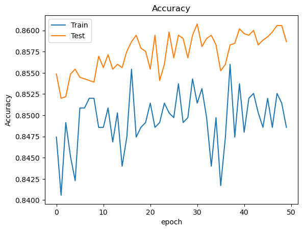

# Model for customer churn at bank .

## NON-TECHNICAL EXPLANATION OF YOUR PROJECT
Customer Chrun is a major challenge for almost every industry. Specially for Banks this has a negative impact as bank's customer are generally long term and it take time to build that relation ship .  Analysis of customer churn  and reducing it by adopting different strategies is one of top priority for the banks.  To Anlayze customer churn at bank have build 3 models 1. Based on Logistic regression 2. based on Neural Network 3. Based on Decision Tree.

## DATA
Data used is from Kaggle , data had more than 60000 record which reduced to 10000 , this data has features like credit score, balance , country , estimated salary , vintage of customer , credit card relatioship  and outcome customer churned or not.

## MODEL 
A summary of the model you’re using and why you chose it. 

i created 3 models to do comparision and recommending a final model , these 3 models are based on 1. Logisitic regression 2 Neural Network based on Tensorflow with different batch size epoch varying from 10 to 50 3. DecisionTreeClassifier with different max depth.  Both Neural Network and high depth DT performed almost same but Tree depth with 5 may be overfitting scenario so recommended  neural network with bbatch size 10 epoch 50.

## HYPERPARAMETER OPTIMSATION

For Neural network Hyperparameter tuned were 1. Number of hidden layers, started with 11-8-4-1 ( 1 input layer , 2 hidden layers and 1 output) but setted with 1 input-1 hidden-and 1 output.   2. Number of nodes in each layer started with 11-6-4-1 but turn out to be 11-8-1 perfomed better 3. Epoch and Batch Size , epoch tuned from 10 to 50 and bbatch size tuned from 20 to 10.

## RESULTS
A summary of your results and what you can learn from your model 

You can include images of plots using the code below:

## (OPTIONAL: CONTACT DETAILS)
If you are planning on making your github repo public you may wish to include some contact information such as a link to your twitter or an email address. 

