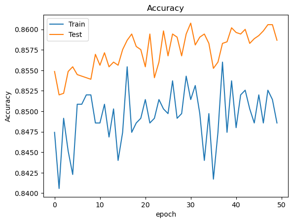

# Model Card
This is a binary classification problem
i created 3 models to do comparison and recommending a final model , these 3 models are based on 1. Logistic regression 2 Neural Network based on Tensorflow with different batch size epoch varying from 10 to 50 3. DecisionTreeClassifier with different max depth.  Both Neural Network and high depth DT performed almost same but Tree depth with 5 may be overfitting scenario so recommended  neural network with batch size 10 epoch 50.

so recommeded Neural Network.

## Model Description

**Input:** there were 10 input feature

Credit_score  ,
Country   ,               
sex       ,
Age    ,
Tenure_with_bank_year   ,
Balance        ,
NumOfProducts     ,
OwnCard           ,
IsActiveMember      ,
estSalary           .

with composition like

Sex 
Male    -  5457,
Female  -  4543

Country
France   -  5014,
Germany   - 2509,
Spain    -  2477

estSalary
max  -199992.48,
min  -11.58

Credit_Score
max  -850,
min  - 350

Output(Y) customer churned or not(Exited)

0 --7963- No,
1 --2037 -Yes

**Output:** Output is a binary classifcation of whther customer is churned or not. in complete data set.

Output(Y) customer churned or not(Exited)

0 --7963- No,
1 --2037 -Yes

Model 

**Model Architecture:** Model used was 1 input- 1 hidden layer- 1 output layer with these many nodes  11-8-1 for each layer. activation function used activation='relu'.   for training ,  used adam optimizer with binary cross entry loss function.

## Performance

A summary of your results and what you can learn from your model 
Model 1 which is based on Logistic regression scored- Score of logistic regression is 80.66%
Model 2 - Neural Network based model with different epoch ,batch size , different hidden layer and nodes scored between 83-86%
Model 3 - Decision Tree based model with different depth of default to 2 to 5 scored between 81-85.5%,  bigger depth like 5 may lead to overfitting so recommended Model2.

Model 2 performance with different epoch

## Limitations

Perormance with larger data set like 1 Million or more record is not known ,increasing the hidden layer lead to decrease in performances so need to refine for larger data set as well

## Trade-offs

These lead to peformance issues so did this trade off .1. Number of hidden layers, started with 11-8-4-1 ( 1 input layer , 2 hidden layers and 1 output) but settled with 1 input-1 hidden-and 1 output.   2. Number of nodes in each layer started with 11-6-4-1 but turn out to be 11-8-1 performed better 3. Epoch and Batch Size , epoch tuned from 10 to 50 and batch size tuned from 20 to 10.
